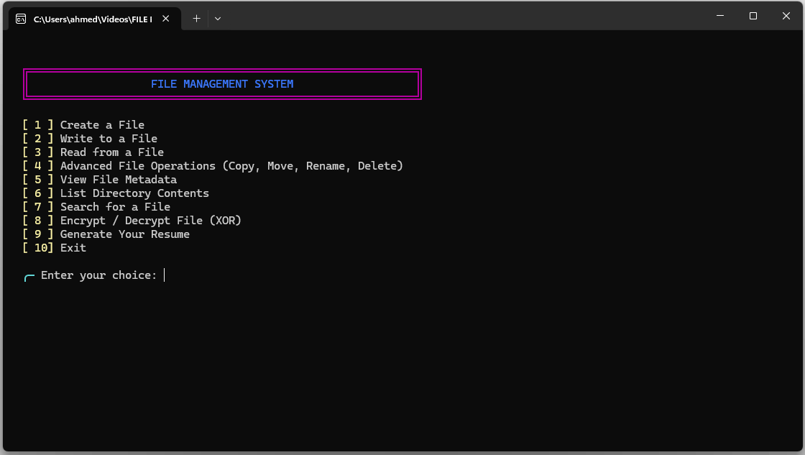
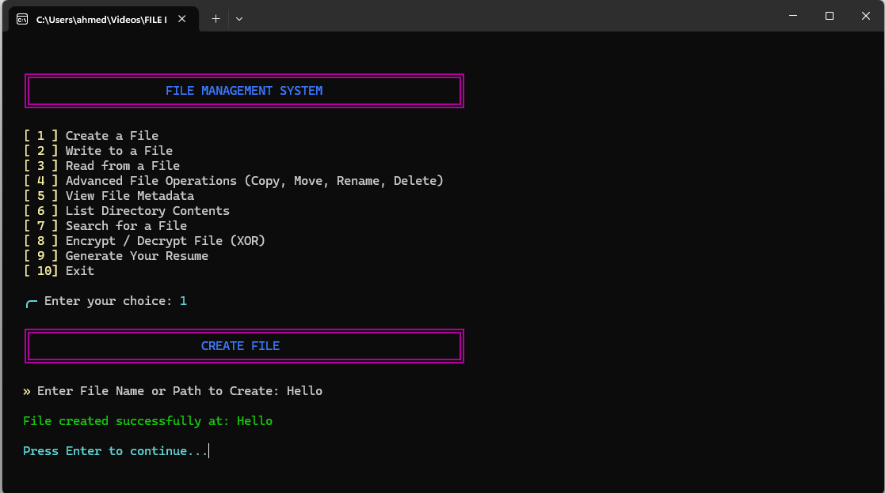

<div align="center">

# 🗂️ File Management System

**A color-enabled Windows CLI for everyday file-management tasks — built entirely in C.**

[](https://en.wikipedia.org/wiki/C11_(C_standard_revision))
[](#requirements)
[](#build-and-run)
[](LICENSE)
[](#academic-details)

</div>

---

## Overview

**File Management System** is a terminal-based application that brings common file and directory operations — creation, editing, copying, moving, searching, inspection, and a lightweight XOR-based file transformation — into a single, numbered, color-coded menu.

It was built with an emphasis on clean C, direct use of the Windows API, and a genuinely usable interface rather than a bare proof-of-concept.

## Table of Contents

- [Features](#features)
- [Screenshots](#screenshots)
- [Requirements](#requirements)
- [Build and Run](#build-and-run)
- [Usage](#usage)
- [Project Structure](#project-structure)
- [Limitations](#limitations)
- [Roadmap](#roadmap)
- [Academic Details](#academic-details)
- [Contributing](#contributing)
- [License](#license)

## Features

| Category | Capabilities |
| --- | --- |
| **File Basics** | Create, write to, and read text files |
| **Advanced File Operations** | Copy, move, rename, and delete files |
| **File Inspection** | View file size, and created / modified / accessed timestamps |
| **Directory Tools** | List folders and files in a directory (with file sizes) |
| **Search** | Case-insensitive search for files or folders by name |
| **CV Generator** | Produce a plain-text CV from details entered interactively |
| **XOR Transform** | Password-based XOR transformation on a file; re-applying the same password reverses it |

## Screenshots

<div align="center">

**Main menu**



**File creation confirmation**



</div>

## Requirements

- Windows 10 or later
- A C compiler with Windows support — [MinGW-w64 GCC](https://www.mingw-w64.org/) is recommended
- A terminal with ANSI escape-sequence support (Windows Terminal recommended)

## Build and Run

From the project root, in PowerShell:

```powershell
New-Item -ItemType Directory -Force bin
gcc -Wall -Wextra -std=c11 src/main.c -o bin/file-management-system.exe
.\bin\file-management-system.exe
```

| Step | What it does |
| --- | --- |
| `New-Item ...` | Creates the local `bin/` output directory if it doesn't already exist |
| `gcc ...` | Compiles `src/main.c` with all warnings enabled, targeting the C11 standard |
| `.\bin\...exe` | Launches the application |

## Usage

1. Run the executable.
2. Choose an option from the numbered main menu.
3. Enter the requested file or directory path — use `.` to work in the current folder.
4. Follow the on-screen prompts; press **Enter** after an operation to return to the menu.

> **⚠️ Caution**
> Creating a file, copying a file, generating a CV, or applying XOR to an existing destination path **will overwrite its contents**. Move and delete operations are also irreversible within the application. Work on copies of important files while testing.

## Project Structure

```text
FILE-MANAGEMENT-SYSTEM/
├── src/
│   └── main.c                 # Application source code
├── docs/
│   ├── PROJECT_STRUCTURE.md   # Project notes and conventions
│   └── screenshots/           # README screenshots
├── bin/                       # Local build output (not committed)
├── .gitignore
├── LICENSE
└── README.md
```

For more detail on layout and conventions, see [`docs/PROJECT_STRUCTURE.md`](docs/PROJECT_STRUCTURE.md).

## Limitations

- Designed for Windows only; directory operations rely on the Windows API.
- The XOR feature is a learning exercise, **not** secure encryption — never use it to protect confidential data.
- Automated tests have not yet been added.

## Roadmap

- [ ] Add automated tests for core file operations
- [ ] Cross-platform support (POSIX file APIs)
- [ ] Configurable/persistent user preferences

## Academic Details

Made for **Semester 1, BS Computer Science** — Course **CS-303: Programming Fundamentals**.

## Contributing

This started as a coursework project, but issues and pull requests — bug reports, small fixes, or feature ideas — are welcome.

## License

Released under the [MIT License](LICENSE).
